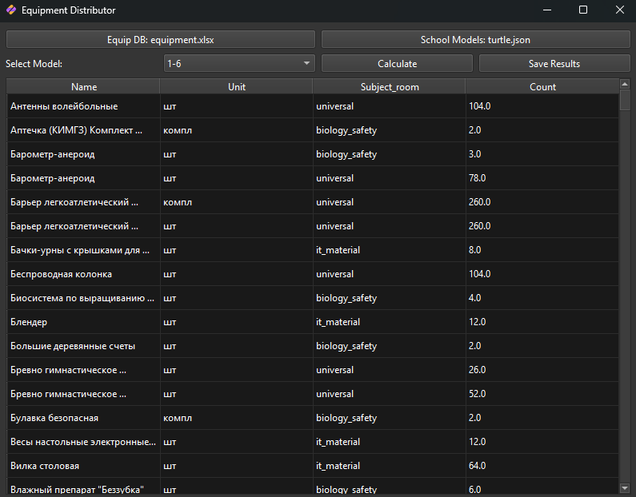

# Equipment Distributor

**Equipment Distributor** — это инструмент для автоматического расчета необходимого школьного оборудования на основе моделей комплектации и базы данных оборудования. Приложение поддерживает как работу через графический интерфейс (GUI), так и через командную строку.

## Возможности

*   **Графический интерфейс (GUI)**: Удобное приложение на PyQt6 с поддержкой темной темы.
*   **Гибкая настройка**: Загрузка базы данных оборудования из Excel (`.xlsx`) и моделей школ из JSON.
*   **Умный расчет**: Автоматическое определение категории помещения (химия, физика, информатика и т.д.) с помощью регулярных выражений.
*   **Экспорт**: Сохранение результатов расчета в форматы Excel (`.xlsx`) или CSV.

## Требования

Для работы проекта необходим Python версии **3.14** или выше (согласно конфигурации проекта).

Основные зависимости:
*   `pandas`
*   `pyqt6`
*   `openpyxl`
*   `ipykernel` (для работы с ноутбуками)

## Установка

Собранное приложение можно найти в [Releases](https://github.com/Arsinenko/equipment_distributor/releases/).

Для запуска из исходного кода:

1.  Клонируйте репозиторий:
    ```bash
    git clone https://github.com/your-username/equipment-distributor.git
    cd equipment-distributor
    ```

2.  Установите зависимости (рекомендуется использовать виртуальное окружение):
    ```bash
    pip install -r requirements.txt
    # или, если вы используете uv/poetry и pyproject.toml:
    uv sync
    ```

## Использование

### Запуск графического интерфейса
Для запуска приложения с GUI выполните команду:
```bash
python distributor.py
```
В открывшемся окне:
1.  Выберите файл базы данных оборудования (Excel).
2.  Выберите файл моделей школ (JSON).
3.  Выберите нужную модель из выпадающего списка.
4.  Нажмите **Calculate** для выполнения расчета.
5.  Нажмите **Save Results** для сохранения итоговой таблицы.

### Запуск через терминал
Для запуска консольной версии скрипта:
```bash
python main.py
```
*Примечание: В `main.py` используются жестко заданные пути к файлам (`care.json`, `equipment.xlsx`). Убедитесь, что они существуют, или отредактируйте скрипт под свои нужды.*

## Структура данных

### Excel (Оборудование)
Ожидаемые столбцы в файле оборудования:
*   `№`, `Раздел`, `Помещение`, `Наименование_2025`, `Ед. изм.`, `КОЛ-ВО на кабинет`

### JSON (Модели школ)
Файл моделей должен содержать словарь, где ключи — названия моделей, а значения — структура с ключом `rooms`, описывающим коэффициенты для каждой категории помещений.

```json
{
    "7-11": {
        "rooms": {
            "informatics": 1,
            "physics": 2,
            "chemistry": 1
        }
    }
}
```

## Разработка
Проект использует регулярные выражения для классификации помещений (см. `regex_rules` в `main.py`). Вы можете расширять список правил для поддержки новых типов кабинетов.
